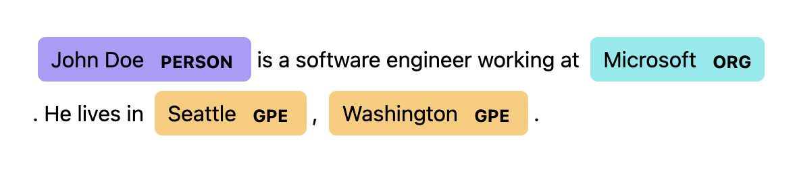

# Named Entity Recognition (NER) Streamlit App

---

## Project Overview
Named Entity Recognition (NER) is an aspect of Natural Language Processing (NLP) that identifies entities such as people, organizations, and locations within provided text.

This app:
- Uses spaCy's pre-trained English language model (en_core_web_sm) to detect standard named entities
- Lets users define their own custom patterns (e.g., WIZARD: Gandalf) using spaCy’s EntityRuler
- Displays detected entities with color-coded highlights using spaCy's built-in displaCy visualizer.
- Analyzes and summarizes the top 10 most frequent entities and the frequency of their occurence in the text

---

## Setup Instructions

### Running the App Locally:

- Clone this repository
- Navigate to the project directory: cd NERStreamlitApp
- Install dependencies
    - pip install streamlit
    - pip install spacy
    - pip install pandas
    - python -m spacy download en_core_web_sm (English language model)
- Run the app using the command "streamlit run main.py"

---

### Link to Deployed Version:

- Try the app live here: [**NER Streamlit App**](https://rogers-ner-app.streamlit.app/)

---

## App Features

### Text Input:
- Paste Text directly into the input box or upload a .txt file for automatic analysis

### Define Custom Entity Patterns:

- Add your own entities using this format: LABEL:TEXT
- LABEL represents what you want the recognized text/pattern to be labeled as
- TEXT represents the text that you want to be considered under that label

### Visualize Entities
- Entities are highlighted in the text using spaCy's displaCy visualization tool
- The app shows both built-in and user-defined entities

### Analyze Entity Frequency
- View a table of the top 10 most common Label-Text combinations
- Helpful for getting an overall summary of what entities are being detected most frequently

---

## References
- [spaCy Documentation](https://spacy.io/usage/spacy-101)
- [Entity Ruler Guide](https://ner.pythonhumanities.com/02_01_spaCy_Entity_Ruler.html)
- [Streamlit Documentation](https://docs.streamlit.io/)

---

## Example of Text Processed Using NER in This App

