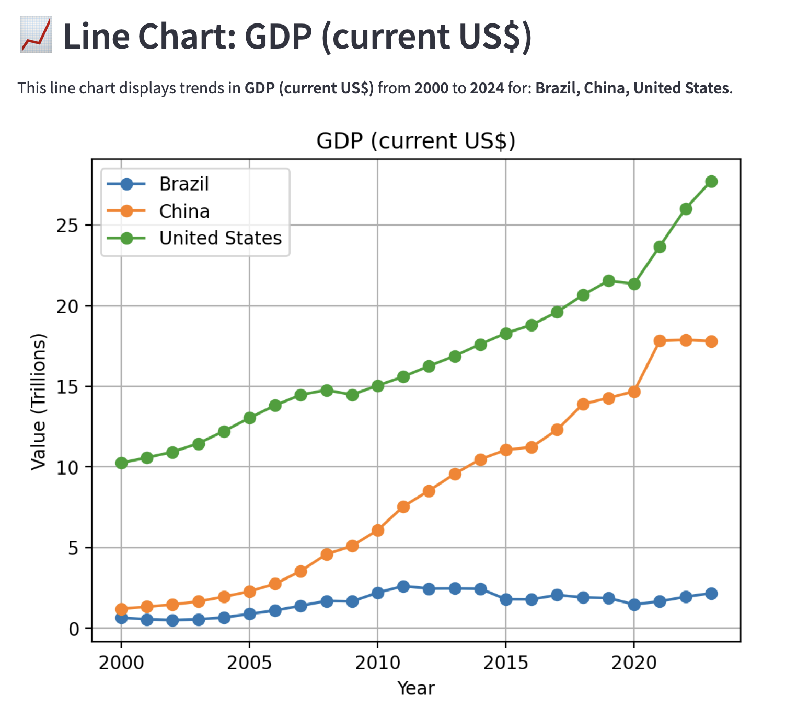
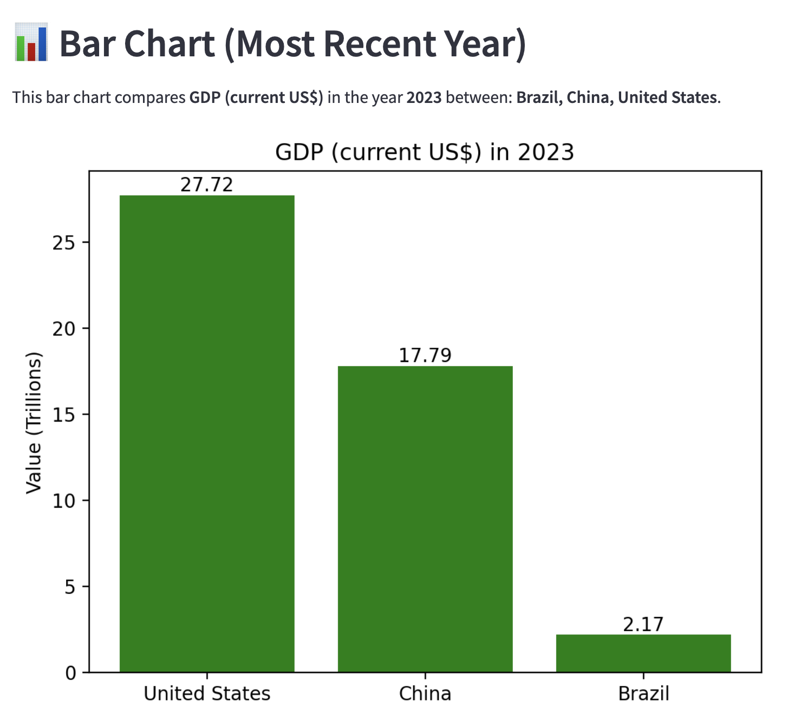

# Country Comparison Streamlit App

---

## Project Overview
The **Country Comparison App** is an interactive data visualization tool. It allows users to explore and compare international development indicators (such as GDP, population, or life expectancy) across multiple countries over time using data from the [World Bank's World Development Indicators](https://databank.worldbank.org/source/world-development-indicators).

Users can either upload their own CSV file downloaded from the World Bank with whatever countries, metrics, or years they want, or interact with the provided sample dataset which contains data for 5 countries across 8 indicators.

This app demonstrates:
- File uploading and validation
- Long-format data wrangling with pandas
- User interactivity with Streamlit widgets/input boxes
- Dynamic line and bar charts with matplotlib
- Responsive labeling and auto-scaling based on data ranges

---

## Setup Instructions

### Running the App Locally:

- Clone this repository
- Navigate to the project directory: cd StreamlitAppFinal
- Install dependencies
    - pip install streamlit
    - pip install pandas
    - pip install matplotlib
    - pip install os
- Run the app using the command "streamlit run main.py"

---

### Link to Deployed Version:

- Try the app live here: [Country Comparison App]

---

## App Features

### Flexible Data Input:
- Use the sample dataset or upload a new CSV downloaded from the [World Bank website](https://databank.worldbank.org/source/world-development-indicators)

### Dynamic Country and Indicator Selection:

- Choose as many countries as desired to compare against each other
- Select any available development indicator

### Year Range Filter
- Easily focus on a specific time period for analysis using the year range slider

### Line Chart
- Visualizes trends in the selected indicator over time across the selected countries
- Includes automatic dynamic Y-axis scaling (trillions, billions, etc.)

### Bar Chart
- Compares countries side-by-side for the most recent year of data available/selected by the year slider
- Labels exact values above each bar for clarity

### Filtered Data Table
- Displays the underlying data used in the visualizations

---

## References
- [World Bank World Development Indicators](https://databank.worldbank.org/source/world-development-indicators)
- [Streamlit Documentation](https://docs.streamlit.io/)
- [pandas Documentation](https://pandas.pydata.org/docs/)
- [matplotlib Documentation](https://matplotlib.org/stable/index.html)

---

## Visual Examples

### Line Chart
Trends in GDP per capita from 2000 to 2022 for China, Brazil, and the United States:

### Bar Chart
Side-by-side comparison of GDP per capita in 2022 for China, Brazil, and the United States:
