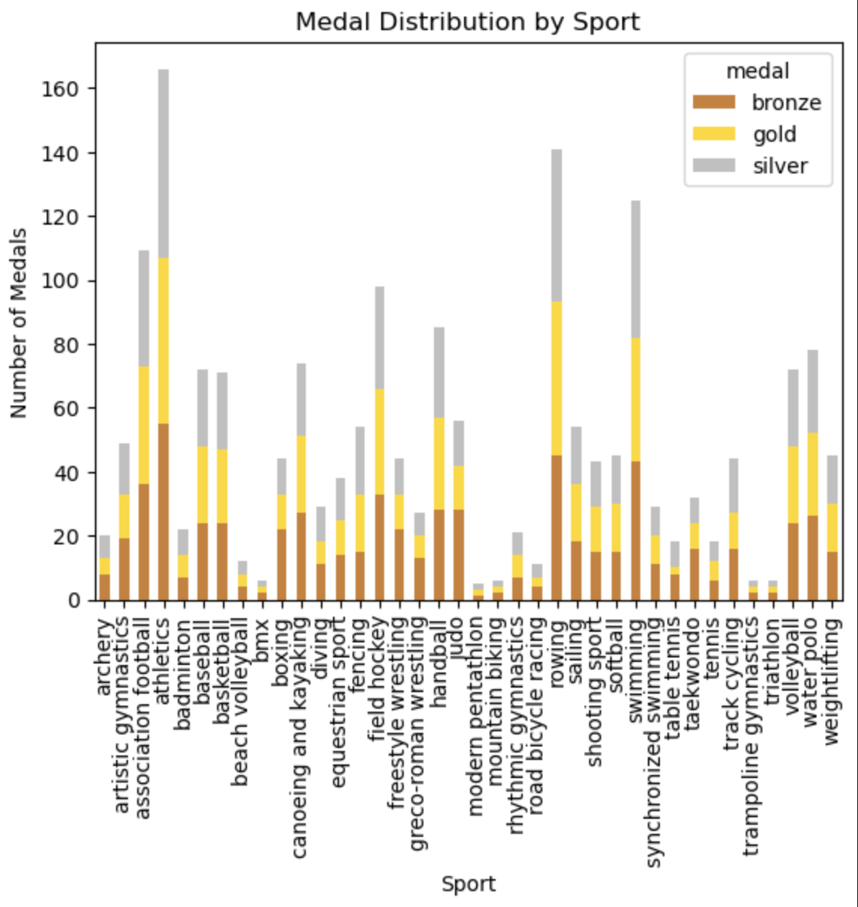
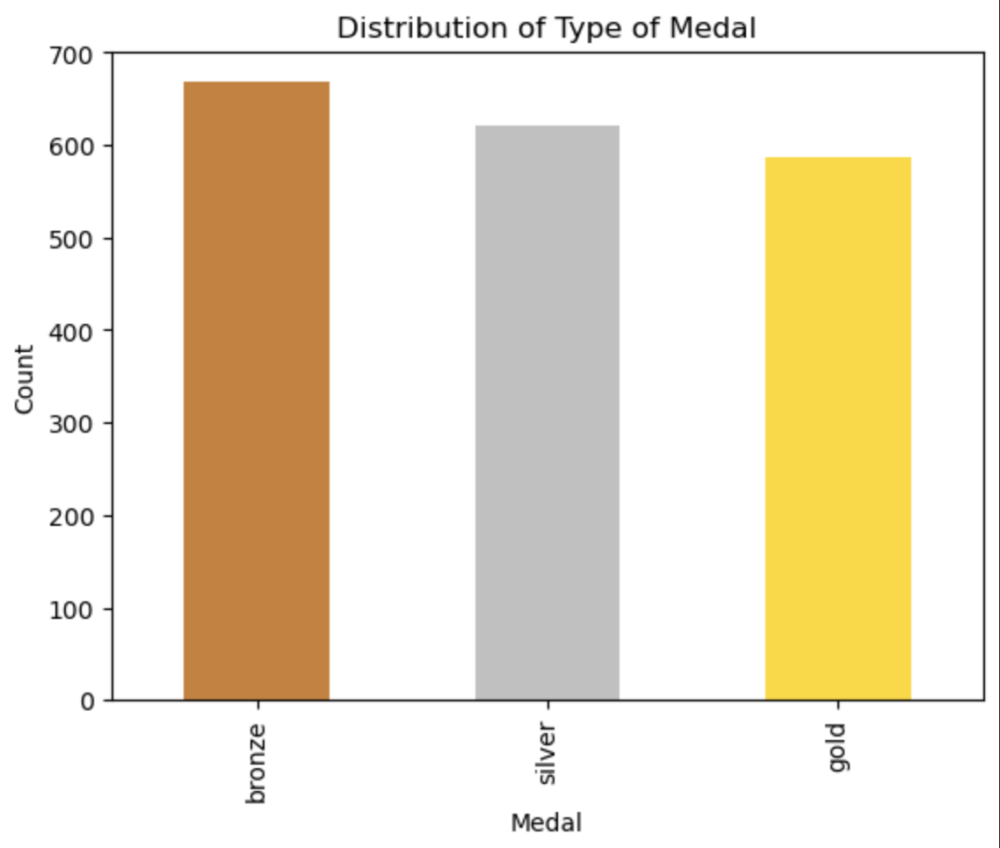
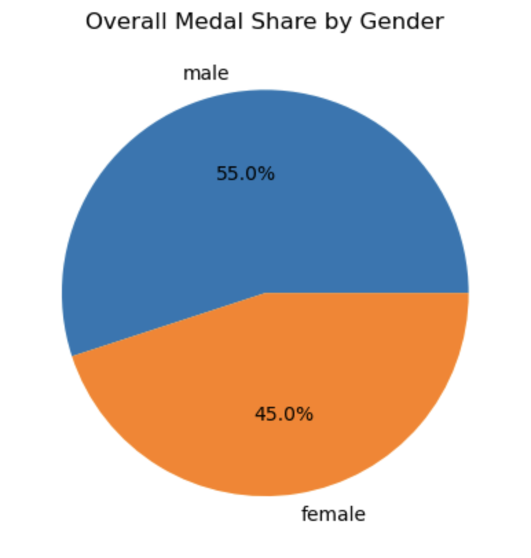

# 🏅 Olympic Medalist Data Analysis (2008 Beijing Summer Olympics) – Tidy Data Project

---

## Project Overview:

This project investigates medalist data from the 2008 Summer Olympics using **Python** and **Jupyter Notebook**. 

The main goal is to clean and reshape what was originally a messy, wide-format dataset into a **tidy, long-format dataset** in order to enable clear and efficient data analysis and visualization.

Throughout this project I apply the 3 key tidy data principles:
- **Each variable forms a column** (gender, sport, and medal type)
- **Each observation forms a row** (one medal awarded)
- **Each type of observational unit forms a table** 

In the case of this project, we have only one type of observational unit: Olympic medals. We therefore only work with one table.

This enables the user to:
- Summarize the distribution of medals across sports and gender
- Create stacked bar charts, pie charts, and pivot tables to illlustrate trends in the data
- Analyze patterns and trends in the data across gender, sport, and medal type

---

## Setup and Run Instructions:

1. Clone this repository
2. Navigate to the project directory: cd TidyData-Project
3. Install dependencies:
    - pip install pandas
    - pip install matplotlib.pyplot
4. Run each cell sequentially from top to bottom.

---

## Dataset Description

- Source: [**olympics.csv**](olympics.csv) – data on medalists from the 2008 Summer Olympics in Beijing
- Structure:
    - The original dataset is in wide format, with one column per gender-sport combination
    - Each row initially represents a medalist, with only one medal per row.
- No other pre-processing steps are required, as all data cleaning and analysis occurs within the notebook itself.

---

## References: 

Must have a pdf viewer installed (e.g., [vscode-pdf](https://marketplace.visualstudio.com/items?itemName=tomoki1207.pdf)) to view these files:

1. [Pandas Cheat Sheet](media/Pandas_Cheat_Sheet.pdf)
2. [Tidy Data Principles](media/tidy-data.pdf)

---

## Visual Examples:

Visualization #1:

Visualization #2:

Visualization #3:

